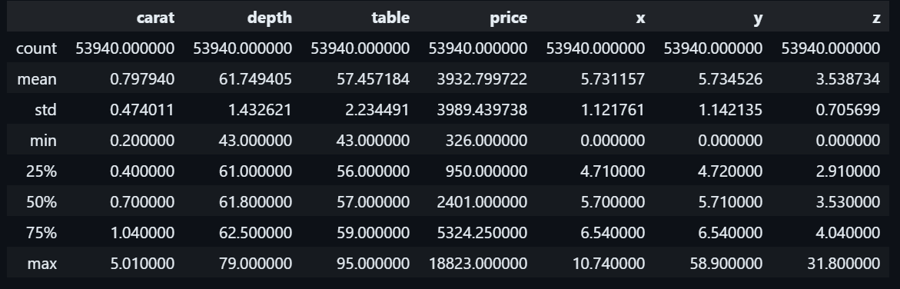
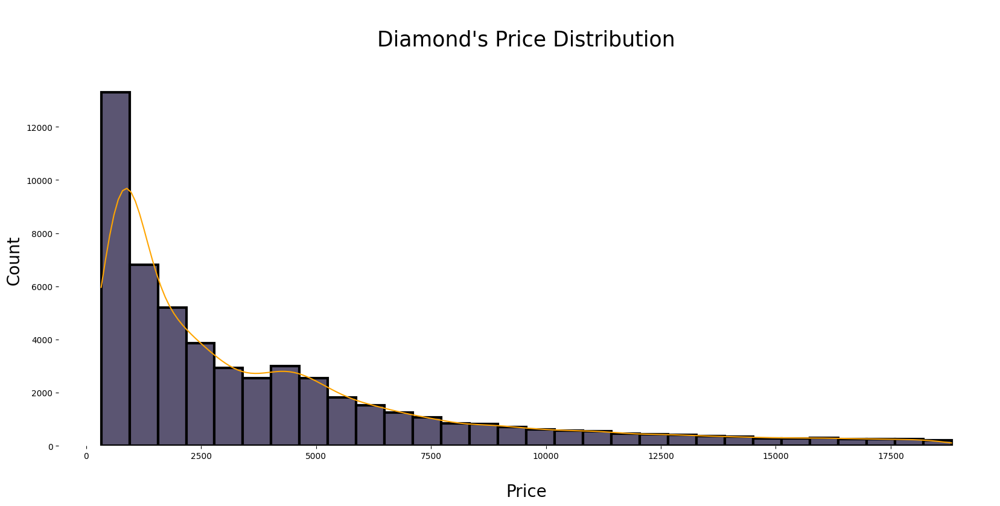
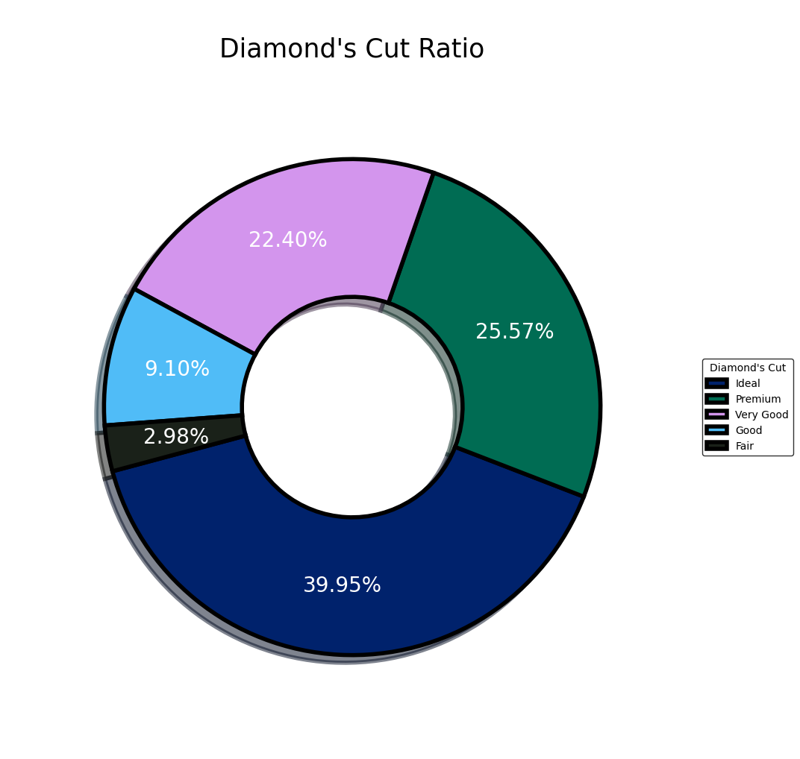
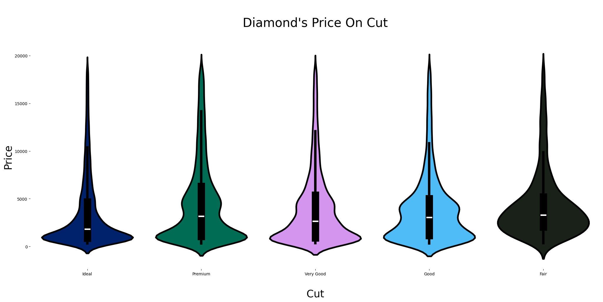

# Cloud-hosted Notebook

### Overview
This project performs in-depth analysis of a dataset using various statistical techniques. It generates comprehensive reports on the full dataset and individual columns, including summary statistics, mode, and variance.

It utilizes the **Diamond Dataset** to perform descriptive statistics using **Pandas** on a **Cloud-based Jupyter Notebook**.

[Colab Notebook](https://colab.research.google.com/drive/1GC2Sfne7ppouv4_vHLYtxAegazILd_F9?usp=sharing)

> For a more comprehensive analysis of the dataset check my other repository [diamonds_dataset_analysis](https://github.com/monatagelsir7/diamonds_dataset_analysis)

## Summary Statistics

## Diamond Price Distibution

## Diamond Cut Ratio

## Diamond's Price on Cut
